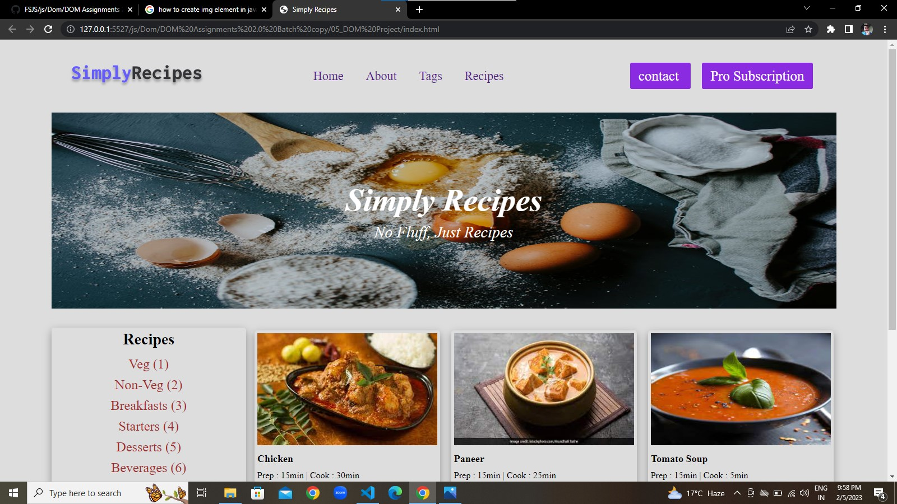
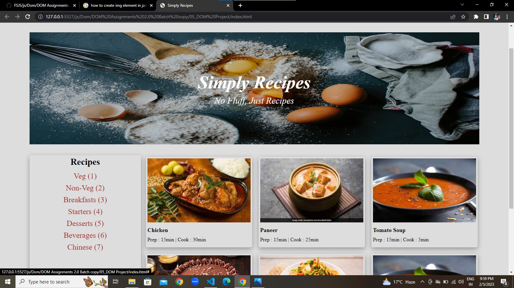
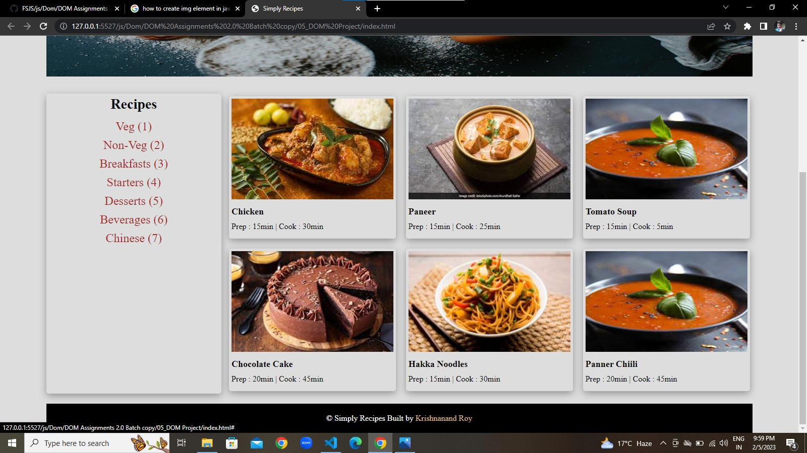
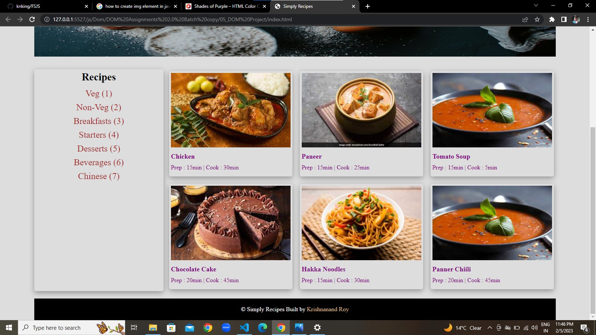

# DOM Assignment 5
## Task 1
User has to add **Pro Subscription** Button in Nav Bar
### After Update


### Project Solution
```javascript
 // pro subscription button added to nav bar
        let element = document.querySelector(".nav-links + div");
        let lst = document.createElement("a");
        lst.className = "btn";
        lst.innerText = "Pro Subscription";
        element.appendChild(lst);
```
## Task 2
user has to add new recipe **Chinesse(7)**
### After Update

### Project solution
```javascript
 let recpie = document.querySelector(".text-r + div");
 console.log(recpie)
 let recipeItem = document.createElement("a");
 recipeItem.innerText="Chinese (7)";
 recpie.appendChild(recipeItem);
```
## Task 3
User has to add **new recipe card(6th card)**
### After Update
 
### Project Solution
```javascript
// code for 6th card
        let cardSix = document.querySelector(".recipe-gallery");
    
        let cardItem = document.createElement("div");
        let cardA = document.createElement("a");
        let cardH = document.createElement("h5");
        let cardP = document.createElement("p");
        let imgTag = document.createElement("img");

        cardItem.className="card";
        cardA.className="recipe-text";
        cardH.className="recipe-name";
        cardP.className="recipe-disp";
        imgTag.className="recipe-img";

        imgTag.src="./img/recipe-3.jpeg";
        cardH.innerText="Panner Chiili";
        cardP.innerText="Prep : 20min | Cook : 45min";

        cardA.appendChild(imgTag)
        cardA.appendChild(cardH);
        cardA.appendChild(cardP)
        cardItem.appendChild(cardA);
        cardSix.appendChild(cardItem)
```
## Task 4
- User has to change **color of all recipe heading and description**
- add name in footer section

### After Update

### Project Solution