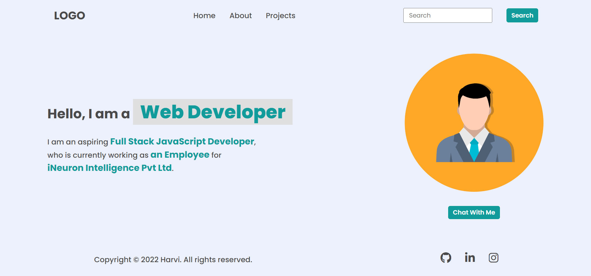

# DOM Assignment 1
## Task 1
The user has to append a new element in the navigation menu named **Hire Me** after the projects

### After Update


### Project Solution
```javascript
let listItem = document.createElement("li");
listItem.innerHTML="<a> Hire Me </a>"
let parent = document.querySelector("header nav ul")
parent.appendChild(listItem)
```
## Task 2
The user needs to change the placeholder message to **Search My Project**
### After Update

### Project solution
```javascript
let searchItem =document.querySelector(".search-field input");
searchItem.placeholder="Search My Project";
```
## Task 3
The user has to change text  **a Freelancer** to **an Employee** and **National and international Client** to **iNeruron inteligance Pvt Ltd**
### After Update

### Project Solution
```javascript
  
      // method 1
let para = document.querySelector(".hero-left-section p");
para.innerHTML=" <p> I am an aspiring <span>Full Stack JavaScript Developer</span>,<br />who is currently working an <span> Empolyee</span> for <br /> <span>iNeuron intelligence Pvt Ltd</span>.</p>"

       // method 2
let para = document.querySelectorAll(".hero-left-section p span");
para[1].innerText="an Employee";
para[2].innerText="iNeuron intelligence Pvt Ltd";
```
## Task 4
The User has to change imgae 
### After Update

### Project Solution
```javascript
let changeImg = document.querySelector(".hero-right-section img");
changeImg.src="https://hiteshchoudhary.com/static/a8d73d1aac4c79e9bb689640e6090367/2eaab/person-image.jpg"
```
## Task 5
The user needs to add one more button **Support Me** bellow image
### After Update

### Project solution
```javascript
let btn =document.createElement("button")
btn.innerText="Support Me"
let element = document.querySelector(".hero-right-section-btns")
element.appendChild(btn)
```

# DOM Assignment 2
## Task 1
The user has to Display the content of **Achievement** and **Hobbies** By default.
### After Update

### Project Solution
```javascript
Array.from(accordian);
accordian.forEach((element) =>{
  element.style.background = "#DADAF8";
} )

// let para = document.querySelectorAll(".accordian-wrapper p");
// para[2].style.display="block";
// para[3].style.display="block";

```

## Task 2
The has to add **Skills** and display there skills
### After Update

### Project Solution
```javascript
let elem = document.createElement("div");
elem.className="accordian";
document.querySelector(".accordian-wrapper").appendChild(elem)
// elem.setAttribute('class','accordian')

let head3= document.createElement("h3");
let newPara = document.createElement("p");


head3.innerText="Skills";
newPara.innerText="i Posses a very good command over the Full Stack Development technologies like MERN which can be seen in my work over the Github.";

elem.appendChild(head3)
elem.append(newPara)


///this code is for background color change
Array.from(accordian);
accordian.forEach((element) =>{
  element.style.background = "#DADAF8";
} )


```