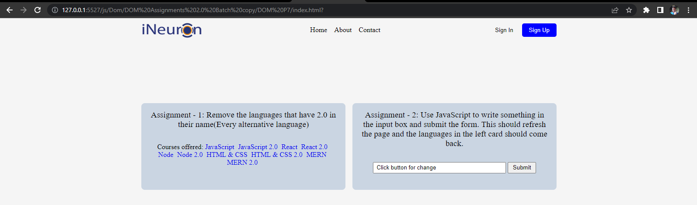

# DOM Assignment 7
## Task One 
User has to Remove the languages that have 2.0 in their name(Every alternative language)
### After Update

### Project Solution
```javascript
 //code to remove language with 2.0 name
let ele = document.querySelectorAll(".main__languages a")
ele.forEach(ele => {
let str = ele.innerText;
      // console.log(s);
if(str.includes(" 2.0")){
ele.style.display="none";
}
});
```
## Task 2
Use has to display again that removed course after button click
### After Update

### Project Solution
```javascript
//Code to display again removed course name
let frm = document.querySelector(".main__form-input").disabled = false;
let btn = document.querySelector(".main__form-btn");
btn.disabled = false;
let element = document.querySelectorAll(".main__languages a")

function clickMe(event) {
   event.preventDefault();
   element.forEach(element => {
   element.style.display = "inline";  
      });
      // document.location.reload();
    }
    btn.addEventListener('click', clickMe);
```

