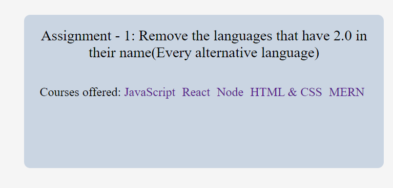

# DOM Assignment 7
## Task One 
User has to Remove the languages that have 2.0 in their name(Every alternative language)
### After Update

### Project Solution
```javascript
let ele = document.querySelectorAll(".main__languages a")
ele.forEach(ele => {
let str = ele.innerText;
      // console.log(s);
if(str.includes(" 2.0")){
ele.style.display="none";
}
});
```
