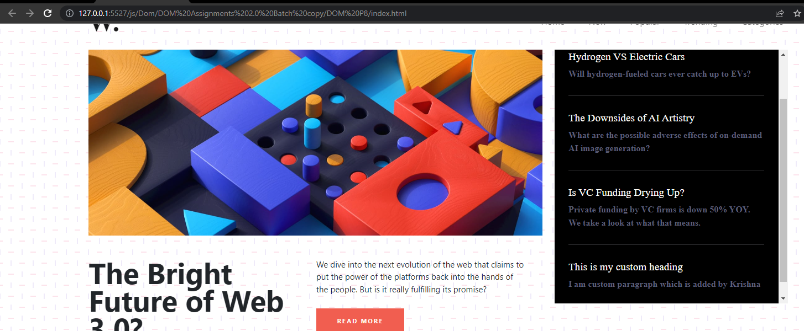

# DOM Assignment 8
## Task 1
User has to add **scrollbar** to the right section
### After Update

### Project Solution
```javascript
let scrollDiv = document.querySelector(".col-lg-4") ;
scrollDiv.style.overflowX="hidden";
scrollDiv.style.overflowY="auto";

let scrollh2 = document.createElement("h2");
scrollh2.className="new-head";
scrollh2.innerText="This is my custom heading";

let scrollPara =document.createElement("p");
scrollPara.className="new-p";
scrollPara.innerText="I am custom paragraph which is added by Krishna";

let hrLine = document.createElement("hr");
hrLine.className="hr-line";
scrollDiv.appendChild(hrLine);
scrollDiv.appendChild(scrollh2);
scrollDiv.appendChild(scrollPara);
```
